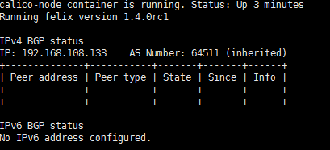
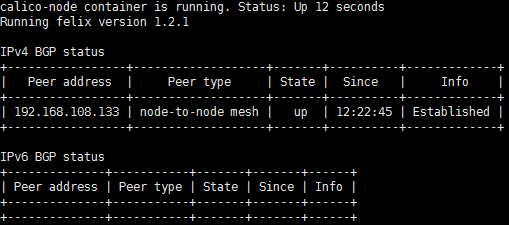
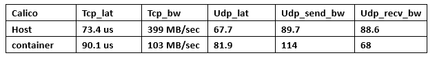

# Overlay Network for Docker —— Calico
***
本文主要叙述使用Calico网络为Docker容器进行跨主机连接和隔离的配置，以及对其深层次的原理有一定的深究。

## 简介
***

[Calico](https://github.com/projectcalico/calico)是一个纯3层协议，支持VM、Docker、Rocket、OpenStack、Kubernetes、或者直接在物理机上使用。官网上给出可以支持上万个主机、上百万的工作负载（container），由于它是纯三层协议，使用BGP协议（基于IP），更易于调试，支持IPv6，支持灵活的安全策略。

## Calico的安装
***

\#安装calico将可执行文件加到系统路径下即可    
$ sudo wget http://www.projectcalico.org/builds/calicoctl  
$ sudo chmod a+x calicoctl  
$ sudo cp calicoctl /usr/local/bin

## Calico配置docker的简单场景
***
\#主机一IP：192.168.108.131  
\#主机二IP：192.168.108.132  
\#主机三IP：192.168.108.133  

\# 建立Etcd集群，这里使用自发现模式,etcd官网提供了集群的公共访问的etcd存储地址，通过如下命令得到etcd服务的目录，作为-discovery参数使用

$ sudo curl http://discovery.etcd.io/new?size=2  #集群结点数为2

\#得到的返回值如下，后面每个节点加入集群的时候需要用作参数：
https://discovery.etcd.io/823a0ed21e0b915d2d6c9d8998572ada

\#在每个节点上运行
$ sudo etcd -name [Node_Name] \  
-initial-advertise-peer-urls http://[Node_IP]:2380 \  
-listen-peer-urls http://[Node_IP]:2380 \  
-discovery [上面返回的结果]

\#查看etcd集群信息:在其中任何一个主机上可以查看到集群的信息  
$ sudo etcdctl member list 

746147aa2b01123e: name=node2 peerURLs=http://192.168.108.132:2380   clientURLs=http://localhost:2379,http://localhost:4001  
acf4d40ae6f803c1: name=node1 peerURLs=http://192.168.108.133:2380   clientURLs=http://localhost:2379,http://localhost:4001

\#查看etcd存储的共享信息，此时看到的是空的信息  
$ etcdctl ls

此时可以依次在每个主机上启动calico服务,下面的配置方案时在主机二和三之间进行的

### 主机3:192.168.108.133
***
启动calico-node的方式如下：  
$ sudo calicoctl node --ip={host-ip}  
$ sudo calicoctl node --ip=192.168.108.133

> * 此时，通过命令 *docker ps -a*可以看到启动了一个docker容器，NAMES是calico-node，IMAGE是calico/node:latest
> * 此时，通过命令 *calicoctl status*可以查看到calico服务的状态如下：可以看到使用的IPv4的IP地址，而且可以看到使用的协议是BGP协议

### 主机2:192.168.108.132
***
同样启动calico-node
$ sudo calicoctl node --ip=192.168.108.132

> * 此时通过 *calicoctl status*可以查看到信息如下：主机二可以看到集群中的主机三
> * 此时通过 *etcdctl ls也可以看到集群信息*

\#在启动calico服务之后还需要配置地址池，这里是选择的10.0.0.0/16,在集群中任意一主机上运行下面命令  
$ sudo calicoctl pool add 10.0.0.0/16 --ipip --nat-outgoing

### 网络连接与隔离
***

####主机2:192.168.108.132
***
\#启动容器--net=none:conA conB conC     
*$ docker run -itd --name [con-name] --net=none test bash*

####主机3:192.168.108.133
***
\#启动容器--net=none:conD conE

####添加Calico网络
***
#####依次为每个容器设置IP地址
*$ sudo calicoctl container add [container_name] [IP]*
例如：  
*$ sudo calicoctl container add conA 10.0.0.1*

> * 此时可以通过*etcdctl ls *可以看到在 /calico/v1/host/host-2/workload/docker/ 中存储了详细的容器信息

#####添加配置文件，在任意一个主机上，该配置中是想要容器A,C,E之间可以通信，B和D之间可以通信
*$ sudo calicoctl profile add PROF_A_C_E*  
*$ sudo calicoctl profile add PROF_B_D*   

#####将容器添加到某个配置文件中，就可以将不同的容器添加到不同的“子网”中
calicoctl container conA profile append PROF_A_C_E  
calicoctl container conC profile append PROF_A_C_E  
calicoctl container conE profile append PROF_A_C_E  
calicoctl container conB profile append PROF_B_D  
calicoctl container conD profile append PROF_B_D  

#####此时容器A,C,E之间可以相互通信，容器B和D之间可以相互通信，可以看到calico网络可以做到的隔离是以容器为单位的

### 网络性能
***
性能测试如下  

## Integrate Calico with Docker Network
***
在Docker发布了1.9引擎版本之后，Calico可以被集成到Docker-network，calico通过运行一个容器作为Docker-network的插件，而且集成到 *docker network*命令中。

将calico集成到docker-network需要Docker-engine运行在集群模式下

*$ sudo service docker stop*  
*$ sudo /usr/bin/docker daemon -H tcp://0.0.0.0:2375 -H unix:///var/run/docker.sock --cluster-store=etcd://{ETCD_IP}:4001 --cluster-advertise={NODE_IP}:2375*  

然后使用 *--libnetwork*参数运行Calico  
*$ calicoctl node --libnetwork --ip={NODE_IP}*

通过*docker network*命令创建子网  
*$ docker network create --driver=calico --subnet={IP-Range} {NAME}*  

运行容器  
*$ docker run -itd --net {NAME} test bash*

