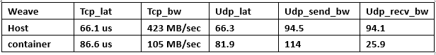

# Overlay Network for Docker —— Weave
***
本文主要叙述使用Weave网络为Docker容器进行跨主机连接和隔离的配置，以及对其深层次的原理有一定的深究。

## Weave简介
***

[Weave](https://github.com/weaveworks/weave)是由Zett.io公司开发的，它能够创建一个虚拟网络，用于连接部署在多台主机上的Docker容器，这样容器就像被连接入了同一个网络交换机，那些使用网络的应用程序不必去配置端口映射和链接等信息。

## Weave的安装
***
Weave安装，可执行文件放到系统环境目录即可.

$ sudo wget -O /usr/local/bin/weave https://raw.githubusercontent.com/zettio/weave/master/weave  
$ sudo chmod a+x /usr/local/bin/weave

## Weave配置docker的简单场景
***
\#主机一IP：192.168.108.131  
\#主机二IP：192.168.108.132  
\#主机三IP：192.168.108.133  

###主机一：192.168.108.131
***
\#主机一上启动weave  
$ weave launch

> 来看看weave launch这条命令做了什么：
> 
> * ifconfig查看网卡，添加了四块网卡（准确地来说是两对网卡），分别是datapath,datapath-link,link-weave,weave
> * brctl show查看网桥，添加了网桥bridge:weave，其中它的一个接口interface是link-weave
> * docker ps -a查看容器的信息，建立了两个持续运行的容器weave和weaveproxy，它们的镜像image分别是weaveworks/weave和weaveworks/weaveexec
> * weave status可以查看主机上weave容器的详细信息,此时可以看到的信息Connections为0，Peers为1，默认的IP-Range为10.32.0.0-10.47.255.255，默认子网DefaultSubnet为10.32.0.0/12
> * 此时通过weave run 建立第一个容器（注意是第一个），那么默认情况下它的网卡ethwe的IP地址为10.32.0.1/12，此时再建立其他容器IP地址为自动分配，它们之间可以相互通信
> * 建立容器之后通过weave ps可以看到容器的详细信息ID,MAC地址和IP地址
> * 建立容器之后通过ifconfig命令可以看到多了一个网卡vethweplxxxx，brctl show也可以看到weave网桥添加了接口vethweplxxxx

###主机二:192.168.108.132
***

\#主机二上启动weave  
$ sudo weave launch 

>此时weave status查看的信息还是Connections为0，Peers为1，也就是说现在每个主机上的weave服务是独立的，并没有连通起来

将不同主机上的weave容器连接起来  
$ weave connect 192.168.108.131(主机一的IP地址) 

> * 此时通过weave status查看信息就会发现Connections为1，Peers为2，也就是说现在每个主机上的weave服务是连接起来的，可以互相交换信息
> * 此时通过weave run 建立一个容器（此时相当于是整个集群中的第二个容器），那么默认情况下它的网卡ethwe的IP地址为10.40.0.1/12，此时在主机1上的容器10.32.0.1/12是可以与这个容器相互通信的。

###主机三:192.168.108.133
***

\#主机三上启动weave  
weave launch 192.168.108.132

>* weave launch [IP-地址]命令相当于进行了两条命令，分别是weave launch和weave connect [IP-地址]
>* 此时在任意一个主机上查看weave的状态，显示有3个peer端和6条连接，weave connect是进行对集群中的所有主机进行全连接
>* 由上一点可知，weave launch 192.168.108.131也是同样可以的，效果完全一样

###容器的跨主机通信测试
***
>由上面的论述已经知道，默认情况下建立的容器会自动分配一个不冲突的IP地址，并且它们的主机建立weave连接之后，容器之间是可以相互通信的

那么问题来了，怎么自定义容器的IP地址，并且达到跨主机通信和选择性隔离的要求呢？

1. 通过weave run [IP] 的方式可以建立容器并且指定容器的IP和子网（需要避免默认网段）
2. weave网络的隔离能做到属于同一个子网的容器之间可以相互通信，属于不同子网的容器之间不可以相互通信
3. 因此，weave网络的容器之间做到隔离程度是部分隔离

\#主机一上建立容器  
weave run 10.0.1.1/24 --net=none --name=conA -itd test bash

\#主机二上建立容器  
weave run 10.0.1.2/24 --net=none --name=conA -itd test bash  
weave run 10.0.2.2/24 --net=none --name=conB -itd test bash

\#主机三上建立容器  
weave run 10.0.2.1/24 --net=none --name=conA -itd test bash

\#此时测试容器之间的连通性，在这四个容器之间  
主机二上的conA与主机一上的conA连通  
主机二上的conB与主机三上的conA连通  
其他的互相不连通

这里体现了weave的网络隔离的好处，weave可以使得相同地址段的容器间可以相互通信，不同地址段的容器间不能相互通信;此时当然也不能与默认网络情况下的容器间通信

####网络性能
***
测试的指标如下：

## 原理

1）先创建一个由多个peer组成的对等网络，每个peer是一个虚拟路由器容器，叫做“weave路由器”，它们分布在不同的宿主机上。
Weave路由器：实质上是一个容器。对等网络的peer之间会维持一个TCP连接，用于交换拓扑信息，它们也会建立UDP连接用于容器间通信。

2）Weave路由器通过桥接连接到宿主机的其他容器上。当处于不同宿主机上的容器之间想要通信，
一台宿主机上的weave路由器通过截获数据包，使用UDP协议封装后发给另一台宿主机的weave路由器。

3）每个Weave路由器会刷新整个对等网络的拓扑信息，因此它可以决定数据包的下一跳是哪个容器。
Weave能让两个处于不同的宿主机的容器进行通信，只要这两台宿主机在weave拓扑结构内连到同一个weave路由器。

4）weave run：取代了docker run的原因是weave命令内部会调用docker命令来新建容器然后为它设置网络。
容器内部和容器外的虚拟接口对形式和docker0网桥的虚拟接口对形式一样。