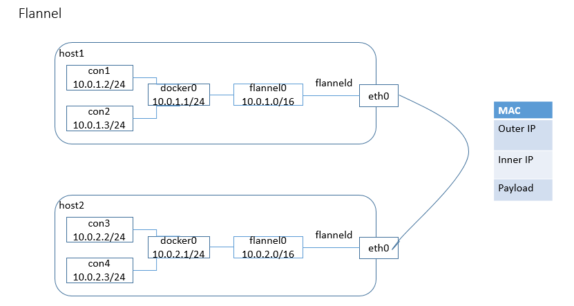
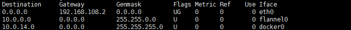
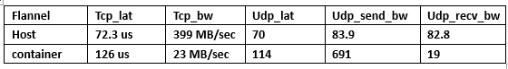

# Overlay Network for Docker : Flannel
***

Flannel是 CoreOS 团队针对 Kubernetes 设计的一个覆盖网络（Overlay Network）工具，其目的在于帮助每一个使用 Kuberentes 的 CoreOS 主机拥有一个完整的子网。本文将从Flannel的介绍、工作原理及安装和配置三方面来介绍这个工具的使用方法。

## Flannel介绍
***
Flannel是Docker容器网络的一个规划服务，它的它的功能是让集群中的不同节点主机创建的Docker容器都具有全集群唯一的虚拟IP地址。

在Flannel的网络模型中，假设了每个物理节点应该具备一段“属于同一个内网IP段内”的“专用的子网IP”。例如：
> * host1:10.0.1.0/24
> * host2:10.0.2.0/24
> * host3:10.0.3.0/24

但在默认的Docker配置中，每个节点上的Docker服务会分别负责所在节点容器的IP分配。这样导致的一个问题是，不同节点上容器可能获得相同的内外IP地址。并使这些容器之间能够之间通过IP地址相互找到，也就是相互ping通。

Flannel的设计目的就是为集群中的所有节点重新规划IP地址的使用规则，从而使得不同节点上的容器能够获得“同属一个内网”且”不重复的”IP地址，并让属于不同节点上的容器能够直接通过内网IP通信。

## Flannel的工作原理
***

Flannel实质上是一种“覆盖网络(overlay network)”，也就是将TCP数据包装在另一种网络包里面进行路由转发和通信，目前已经支持UDP、VxLAN、AWS VPC和GCE路由等数据转发方式。

默认的节点间数据通信方式是UDP转发，Flannel的原理图如下：

数据从源容器中发出以后，经由所在主机的docker0虚拟网卡转发到flannel0虚拟网卡，这是个P2P的虚拟网卡，flanneld服务监听在网卡的另一端。

Flannel通过Etcd服务维护了一张节点间的路由表。

源主机的flanneld服务将原本的数据内容通过UDO封装后根据自己的路由表投递给目的节点flanneld服务，数据到达以后被解包，然后直接进入目的节点的flannel0虚拟网卡，然后被转发到目的主机的docker0虚拟网卡，最后就像本机容器通信一样的由docker0转发到目的容器。

## Flannel配置docker容器跨主机连接的简单场景
***

### 主机一：192.168.108.131/24
***
\#首先需要开启Etcd服务,并且删除以前信息  
$ sudo etcd -listen-client-urls http://0.0.0.0:4001 -advertise-client-urls http://127.0.0.1:4001  
$ sudo etcdctl rm /coreos.com/network --recursive  
$ sudo etcdctl mk /coreos.com/network/config '{"Network":"10.0.0.0/16"}'

\#启动Flannel服务，需要监听刚才的4001端口  
$ sudo flanneld -iface="eth0" -etcd-endpoints="http://192.168.108.131:4001"  

> 此时通过ifconfig命令可以查看到新建了一个虚拟网卡flannel0

\# 配置docker0网桥以及重启docker服务  
$ sudo source /run/flannel/subnet.env  
$ sudo ifconfig docker0 ${FLANNEL_SUBNET}  
$ sudo docker daemon --bip=${FLANNEL_SUBNET} --mtu=${FLANNEL_MTU}

> 此时需要关注的信息是网桥信息和路由信息

> * 通过ifconfig命令，可以看到flannel0和docker0网桥的信息，分别为10.0.14.0/24和10.0.14.1/24
> * 看路由表信息如下：

### 主机二：192.168.108.132/24

\#启动Flannel服务，需要监听刚才的4001端口  
$ sudo flanneld -iface="eth0" -etcd-endpoints="http://192.168.108.131:4001"  

\# 配置docker0网桥以及重启docker服务  
$ sudo source /run/flannel/subnet.env  
$ sudo ifconfig docker0 ${FLANNEL_SUBNET}  
$ sudo docker daemon --bip=${FLANNEL_SUBNET} --mtu=${FLANNEL_MTU}

此时分别在host1和host2上建立容器测试，可以连通

### 网络性能测试
***
性能测试如下  

