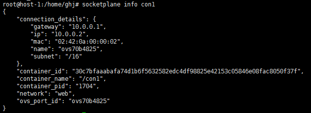

# Overlay Network for Docker : Socketplane
***

Socketplane基于open vSwitch和consul在socket层提供了一种网络抽象层，通过可管理的方式来解决网络管理问题。

## 主要特性
***

SocketPlane作为Docker自支持的网络driver/plugin（扩展插件）,以socketplane的封装命令的形式作为docker的命令行工具。

* Open vSwitch集成
* 用于Docker的零配置多主机网络
* Docker/SocketPlane集群的灵活增长
* 支持多网络
* 分布式IP地址管理(IPAM)

Open vSwitch集成：覆盖（重叠）网络在主机之间建立隧道，在SocketPlane中，是使用OVS在主机上建立隧道。好处在于不需要受到子网/vlan以及其他二层网络的限制。使用OVS的原因是其性能以及对于复杂网络的有良好的API。

用于Docker的零配置多主机网络：SocketPlane的零配置是基于mDNS技术（组播DNS），组播DNS可以用来使局域网内的主机实现相互发现和通信。组播DNS技术使得我们可以灵活地配置一个主机到现有的集群中，一旦主机加入到集群中之后，就会通过consul来获取集群的网络状态信息。

SocketPlane支持建立多个网络，这样就可以做到容器间的隔离，可以选择将不同的容器添加到不同的网络。

分布式IP地址管理：能保证做到集群中没有地址冲突

## SocketPlane配置跨主机容器通信的简单场景
***

\#主机一：192.168.108.131/24  
\#主机二：192.168.108.132/24  

### 主机一：192.168.108.131
***
主机一作为集群中的第一个启动节点，注意集群中只能配置一个主机作为BOOTSTRAP=true

\#启动socketplane  
$ sudo socketplane install 

> * 通过*docker ps -a*可以查看到启动了两个容器，它们分别是powerstrip和socketplane
> * 通过*ovs-vsctl show*可以查看到新建了一个网桥*docker0-ovs*，以及docker0-ovs的详细信息

### 主机二：192.168.108.132
***
主机二作为集群中的非第一个启动节点，其中参数BOOTSTRAP=false

\#启动socketplane  
$ sudo export BOOTSTRAP=false  
$ sudo socketplane install unattended

> * 通过*docker ps -a*可以查看到启动了两个容器，它们分别是powerstrip和socketplane
> * 通过*ovs-vsctl show*可以查看到新建了一个网桥*docker0-ovs*，并且此时可以看到详细的主机之间建立的ovs隧道的信息

### 建立网络
***
\#建立网络web：地址段10.0.0.0/16  
$ sudo socketplane network create web 10.0.0.0/16  

> 此时通过socketplane network list 可以查看到网络的信息

### 运行容器
***
\# 在host1上建立容器con1  
$ sudo socketplane run -n web -itd --name con1 test bash  

> 可以看到这里socketplane run命令封装了docker run 命令

> * 此时通过ovs-vsctl show命令可以查看到docker0-ovs网桥多了一个内部端口ovsxxxx，docker容器的接口都是成对出现，一端在容器内部，另一端在容器外部
> * 此时通过socketplane info con1[container-name]可以看到容器的详细信息，包括IP地址，网桥接口对等等

\# 在host2上建立容器con2  
$ sudo socketplane run -n web -itd --name con2 test bash

此时进行测试，发现con1和con2是可以通信的。

### 网络性能

网络性能测试如下：

## Socketplane Clustering 集群化
***
上述的简单场景需要Socketplane所在的环境是一个局域网，而且必须支持mDNS服务，这使得该方式有一定的局限性。

所以，Socketplane还有一种集群化的方式来静态的搭建集群，而不是通过自身的mDNS支持。

简单场景如下：

### host1：作为集群的第一个节点
***
集群中的第一个节点需要绑定一个网络接口，一个网卡；此时在不同主机上启动socketplane服务都是只需要通过 *socketplane install*启动

\#host1上启动socketplane服务  
$ sudo socketplane install   \#在之后的选项中选择作为第一个节点  
$ sudo socketplane cluster bind eth0   

\#host2上启动socketplane服务，并且加入到集群中  
$ sudo export BOOTSTRAP=false  
$ sudo socketplane install unattended  
$ sudo socketplane cluster join [IP]

这种方式也可以建立多主机容器的网络通信。

