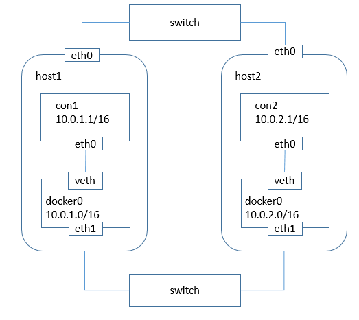
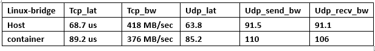
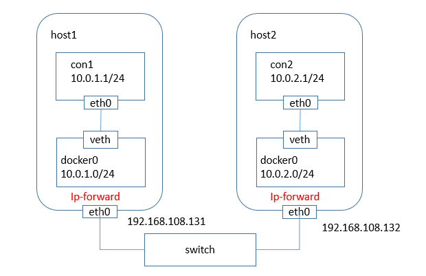
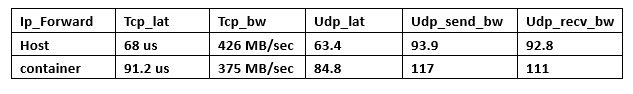

# Overlay Network for Docker : 桥接和路由
***

如果将Docker容器应用在大规模集群环境中，不可避免地会遭遇Docker容器跨主机通信的问题，在目前Docker默认网络环境下，单台主机上的Docker容器可以通过docker0网桥直接通信，而不同主机上的Dokcer容器之间只能通过在主机上做端口映射的方法进行通信。这种端口映射的方式对很多集群应用来说极不方便。如果能使Docker容器之间直接使用本身IP地址进行通信，很多问题就会自然化解。

解决这个问题最简单的两张方式就是桥接和路由方式。

## 桥接
***
>如果通过桥接通过虚拟网络将Docker容器桥接到本地网络环境中，把同一个局域网中不同主机上的Docker容器都配置在主机网络环境中，它们之间可以直接通信，但是这么做可能会出现以下问题：

> * Docker容器会占用主机网络的IP地址
> * 大量Docker容器可能引起广播风暴，导致主机所在网络性能的下降
> * Docker容器连在主机网络中可能引起安全问题

因此，如果情况不是无法回避，必须将Docker容器连接在主机网络中，最好还是将其分开。为了隔离Docker容器间网络和主机网络，需要额外使用一块网卡桥接Docker容器。思路还是与使用一块网卡时一样：在所有主机上用虚拟网桥将本机的Docker容器连接起来，然后将一块网卡加入到虚拟网桥中，使所有主机上的虚拟网桥级联在一起，这样，不同主机上的Docker容器也就如同连在了一个大的逻辑交换机上。

关于Docker容器的IP，由于不同机器上的Docker容器可能获得相同的IP地址，因此需要解决IP的冲突问题。一种方法是使用pipework为每一个容器分配一个不同的IP，而不使用Docker daemon分配的IP。此种方法相对繁琐，因此采用另外一种方法——为每一台主机上的Docker daemon指定不同的--fixed-cidr参数，将不同主机上的Docker容器的地址限定在不同的网段中。

### 桥接方式配置跨主机容器通信的简单场景
***

图中，两个主机host1和host2上，每台主机上有两块网卡eth0和eth1。eth0作为主机的主网卡连在主机的局域网环境中，其IP分别为192.168.108.131和192.168.108.132;eth1用来桥接不同主机上的Docker容器，因此eth1不需要配置IP。

Docker安装完成后，默认情况下docker容器的IP地址是从docker0所在的网络中获取IP。在本例中，将host1上的容器IP范围限制在10.0.1.0/24网段中，将host2上的容器IP地址范围限制在10.0.2.0/24网段中，以避免和host1上的容器IP地址冲突，同时设置host1和host2上的docker0网桥的地址为10.0.1.0/16和10.0.2.0/16以进行通信，然后将eth1桥接到docker0中。

\# 在主机1上进行  
\# 配置docker0并且重启docker服务  
\# sudo ifconfig docker0 10.0.1.0/16  
\# sudo service docker stop   
\# sudo docker daemon --fixed-cidr=10.0.1.0/24  
\# 将eth1网卡接入到docker0网桥  
\# sudo addif docker0 eth1

\# 在主机2上进行  
\# 配置docker0并且重启docker服务  
\# sudo ifconfig docker0 10.0.2.0/16  
\# sudo service docker stop   
\# sudo docker daemon --fixed-cidr=10.0.2.0/24  
\# 将eth1网卡接入到docker0网桥  
\# sudo addif docker0 eth1

最后经过在host1和host2上建立容器分别测试，可以通信。

### 网络性能测试
***
性能测试如下  

### 原理
***
容器1(10.0.1.1/24)向容器2(10.0.2.1/24)发送数据的过程是这样的：首先，通过通过查看本身的路由表发现目的地址和自己处在同一网段，那么就不需要将数据发往网关，可以直接发给con2，con1通过ARP（地址转换协议）广播获取到con2的MAC地址后，然后构造以太网帧发往con2即可，其中docker0网桥充当普通的交换机转发数据帧。

##路由
***

桥接方式是将所有主机上的docker容器放在一个二层网络中，它们之间的通信是由交换机直接转发，不通过路由器。另一种方式是跨主机通信的方式是通过在主机中添加静态路由的方式，如果有两台主机host1和host2，两台主机上的docker容器是独立的二层网络，将con1发往con2的数据流先转发到主机host2上，在由host2再转发到其上的docker容器中；反之亦然。

###路由方式配置跨主机容器通信的简单场景
***
如上图所示，由于使用容器的IP进行路由，就必须避免不同主机上的docker容器使用相同的IP地址，所以应该为不同主机上的容器分配不同的IP子网。

上图中，两台主机host1和host2的IP地址分别为192.168.108.131/24和192.168.108.132/24,两台主机上的容器的子网分别是10.0.1.0/24和10.0.2.0/24，并且在两台主机上有这样的规则——所有目的地址为10.0.2.0/24的包都被转发到host2，目的地址为10.0.1.0/24的包都被转发到host1.为此做如下配置：

#### host1：192.168.108.131/24
***
$ sudo ifconfig docker0 10.0.1.0/24  
$ sudo service docker restart  
\#添加路由，将目的地址为10.0.2.0/24的包转发到host2  
$ sudo route add -net 10.0.2.0 netmask 255.255.255.0 gw 192.168.108.132  

#### host2：192.168.108.132/24
***
$ sudo ifconfig docker0 10.0.2.0/24  
$ sudo service docker restart  
\#添加路由，将目的地址为10.0.1.0/24的包转发到host2  
$ sudo route add -net 10.0.1.0 netmask 255.255.255.0 gw 192.168.108.131  
或者使用如下方式添加路由：  
$ sudo ip route add 10.0.1.0/24 via 192.168.108.131

此时在两个主机上分别创建容器con1和con2测试，发现网络连通。

综上所述，从con1发往con2的包，首先发往con1的网关docker0（10.0.1.1/24）,然后通过查看主机的路由得知需要将包发给host2（192.168.108.132），包到达host2后再转发给host2上的docker0网桥(10.0.2.1/24)，最后到达容器con2.

那接下来就可以来理解几个细节了，怎么谈细节呢？

当然是和桥接模式来进行比较了。

* 第一，配置容器IP的方法和范围，在桥接模式中，所有容器的IP地址都限制在10.0.0.0/16这个大网络中，这从docker0的IP地址"/16"和"/24"可以看出。在桥接模式中，我们是使用--fixed-cidr参数的方式将不同主机的容器限制在这个IP网段的一个小范围内。而在直接路由的方式中，不同主机上的docker容器不在同一个网络中，它们有不同的网络号。从上图可以看出，在路由方式下，将host1上的docker0网桥IP设为10.0.1.0/24，那么host1上的docker容器就只能从10.0.1.0/24网段中获取IP。所以，尽管这两种方法都使得容器使用了10.0.1.0/24的相同的IP地址范围，但它们的网络号是不同的。
* 第二，二层网络和三层网络，这两种方式的转发方式也是不同的，桥接网络是二层通信，通过MAC地址转发；直接路由为三层通信，通过IP地址进行路由转发。而我们做的就是添加了静态路由规则。

### 网络性能测试
***
性能测试如下  

## 总结
***
本文介绍的两种跨主机容器通信方式简单有效，但它们都要求主机在同一个局域网中。如果两台主机在不同的二层网络中，又该如何实现容器间的跨主机通信呢？

此时，便有了下文《从桥接到OVS隧道》。

