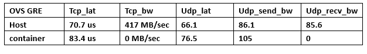

# Overlay Network for Docker —— OVS GRE Tunnel 
***
在前面介绍了桥接和路由方式之后，我们感觉到了桥接和路由的一些缺点和局限，所以就有了下面的方式。
本文主要讲述如何使用使用OVS GRE隧道的方式配置docker容器的跨主机连接。

## OVS GRE隧道方式
***

*桥接方式*和*路由方式*的局限

* 主机必须在同一个子网中，当基础设施的规模足够大时，局限性就会暴露出来
* 主流隔离技术VLAN也有诸多限制，VLAN是在二层帧头发挥作用，也要求主机在同一个子网中；其次，VLAN ID只有12个比特单位，可用的数量有限；除此之外，VLAN配置比较繁琐且不够灵活

这些问题是当前云计算所面临的网络考验，目前比较普遍的解决方法是使用Overlay的虚拟化网络技术。
## Overlay技术模型

***
Overlay网络其实就是隧道技术，即将一种网络协议包装在另一种协议中传输的技术。
>如果有两个使用IPv6的站点之间需要通信，而它们之间的网络使用IPv4技术，这时需要将IPv6的数据包装在IPv4数据包中进行传输。

隧道被广泛用于连接因使用不同网络而被隔离的主机和网络，使用隧道技术搭建的网络就是所谓的Overlay网络。它能有效地覆盖在基础网络之上，该模型可以很好地解决跨网络Docker容器实现二层通信的需求。

在普通的网络传输中，源IP地址和目的IP地址是不变的，而二层的帧头在每个路由器节点上都会改变，这是TCP/IP协议所作的规定。那么，如何使得两个中间隔了因特网的主机像连在一个交换机上一样通信呢？

如果将以太网帧封装在IP包中，通过中间的因特网，最后传输到目的网络中再解封，这样就保证了二层帧头在传输过程中不改变，这也就是早期的Etherent in IP的二层Overlay技术。

至于多租户的隔离问题，解决思路是将不同租户的流量放在不同的隧道中进行隔离。

当前主要的Overlay技术有VXLAN(virtual extensible lan)和NVGRE(network virtualization using generic routing encapsulation)。VXLAN是将以太网报文封装在UDP传输层上的一种隧道转发模式，它采用24位比特标识二层网络分段，称为VNI（vxlan network identifier），类似于vlan ID的作用。NVGRE同VXLAN类似，它使用GRE的方法来打通二层和三层之间的通路，采用24位比特的GRE key来作为网络标识TNI。

### GRE简介
***

使用了GRE隧道之后还需要加路由吗？

GRE实现docker容器在不同的子网中？

### 网络配置的简单场景

如果主机的数量不止两个，那么可以在两两之间选择是否加入GRE隧道来实现隔离。

**主机host1:192.168.108.131**	

**主机host2:192.168,.108.132**

#### 在host1上
***

\#创建ovs网桥ovs0和linux网桥br0,配置br0的IP地址为10.0.1.0/16,并且将br0连接到ovs0上

$ sudo ovs-vsctl add-br ovs0  
$ sudo brctl addbr br0   
$ sudo ifconfig br0 10.0.1.0/16  
$ sudo ovs-vsctl add-port ovs0 br0 

\#添加GRE隧道
$ sudo ovs-vsctl add-port ovs0 gre0 -- set interface gre0 type=gre options:remote_ip=192.168.108.132 

\#重启docker服务，将容器的IP地址段限制在10.0.1.0/24中，并且指定容器的默认网桥是br0，注意这里并没有使用docker服务默认的docker0网桥，当然这里使用docker0和br0并没有明显的区别  
     
$ sudo docker daemon -b=br0 --fixed-cidr=10.0.1.0/24 

#### 在host2上
***

\#创建ovs网桥ovs0和linux网桥br0,配置br0的IP地址为10.0.2.0/16,并且将br0连接到ovs0上

$ sudo ovs-vsctl add-br ovs0  
$ sudo brctl addbr br0   
$ sudo ifconfig br0 10.0.2.0/16  
$ sudo ovs-vsctl add-port ovs0 br0 

\#添加GRE隧道
$ sudo ovs-vsctl add-port ovs0 gre0 -- set interface gre0 type=gre options:remote_ip=192.168.108.131 

\#重启docker服务，将容器的IP地址段限制在10.0.2.0/24中，并且指定容器的默认网桥是br0，注意这里并没有使用docker服务默认的docker0网桥，当然这里使用docker0和br0并没有明显的区别  
     
$ sudo docker daemon -b=br0 --fixed-cidr=10.0.2.0/24 

此时我们进行测试发现在host1上建立容器con1：和host2上建立容器con2之间是可以通信的。

接下来我们来回想一下几个细节

* 
*

### 网络性能测试
***
网络性能测试结果如下：

