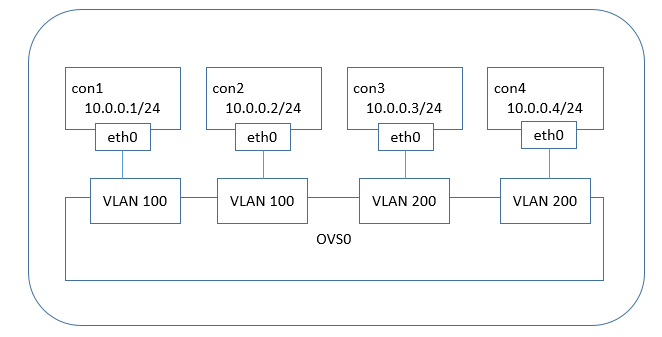
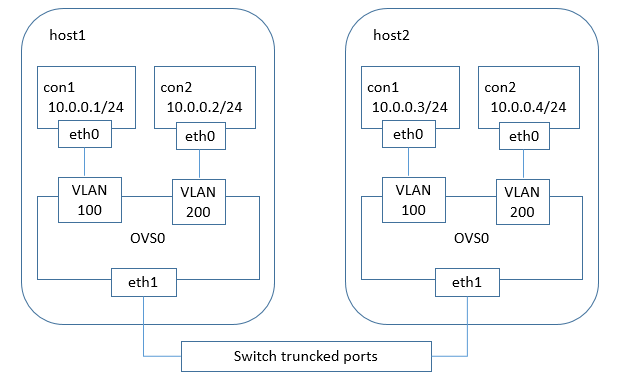
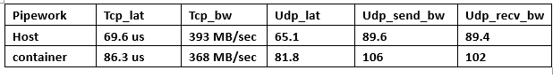

# Overlay Network for Docker —— Pipework
***

本文主要讲述如何使用pipework配置vlan网络。

## pipework跨主机通信 —— OVS划分VLAN
***
在计算机网络中，传统的交换机不能隔离广播域，当网络中的机器很多时有可能会引起广播风暴；同时，不同部门、不同组织的机器连在同一个二层网络中也会造成安全问题。因此，在交换机中划分子网、隔离广播域的思路便形成了VLAN（Virtual Local Area Network 虚拟局域网）的概念，使用VLAN就可以把一个大型交换网络划分为许多个独立的广播域，即VLAN。

VLAN技术将一个二层网络中的主机隔离开来，那么如何区分不同VLAN的数据呢？

IEEE 802.1q协议规定了VLAN的实现方法，即在传统的以太网帧中再添加一个VLAN tag字段，用于标记不同的VLAN。这样，支持VLAN的交换机在转发帧时，不仅会关注MAC地址，还会关注tag字段。VLAN tag字段中包含了TPID，PCP,CFI,VID,其中VID（VLAN ID）部分用来具体指出帧属于哪个VLAN。VID占12位，所以其取值范围为0-4095.

*access端口和trunk端口*

在多租户的云环境中，VLAN是一个基本的隔离手段。其中pipework支持配置容器的VLAN，下面将详细介绍如何使用pipework实现Docker容器的VLAN划分。

### 单主机容器的VLAN划分
***
在docker默认环境中，所以的容器都在docker0网桥上。docker0网桥是普通的linux网桥，不支持VLAN功能，为了方便操作，使用Open vSwitch代替docker0进行VLAN划分。

为了演示隔离效果，图中4个容器都在同一个IP网段中，但实际上它们是二层隔离的两个网络，有不同的广播域。

如上图所示  
\#首先建立四个容器，这里并指定它们的网络为none  
$ docker run -itd --name con1 --net none test bash  
$ docker run -itd --name con2 --net none test bash  
$ docker run -itd --name con3 --net none test bash  
$ docker run -itd --name con4 --net none test bash  

\#使用pipework为四个容器分配IP地址和划分VLAN域  
$ pipework ovs0 con1 10.0.0.1/24 @100  
$ pipework ovs0 con2 10.0.0.2/24 @100  

$ pipework ovs0 con3 10.0.0.3/24 @200  
$ pipework ovs0 con4 10.0.0.4/24 @200  

pipework配置完成后，每个容器都多了一个eth0网卡，eth0连在ovs0网桥上，并且进行了VLAN隔离。此时进行测试的话，会发现con1和con2可以通信，con3和con4之间可以通信，其余不可以。这达到了我们预期的隔离效果。

下面我们就要扩展到多主机问题上。  

### 多主机容器的VLAN划分
***

多主机VLAN情况下，肯定有属于同一个VLAN但是又在不同主机上的容器，因此多主机vlan划分的前提是跨主机通信。前文介绍了两种跨主机通信的方式，要使得不同主机上的容器处于同一个VLAN，就只能采用桥接方式。首先用桥接的方式将所有容器连接在一个逻辑交换机上，在根据具体情况进行VLAN的划分。桥接需要将主机的一块网卡桥接到容器所连接的Open vSwitch网桥上。因此，使用一块额外的网卡eth1来完成，桥接的网卡需要开启混杂模式。

如上图，这里我们将不同的VLAN容器设在同一个子网中，host1上的容器con1和con2 IP地址分别为10.0.0.1/24和10.0.0.2/24，但是它们的VLAN tag分别是100和200；host2上的con3和con4也是如此。由于会有VLAN tag为100和200的帧通过，物理交换机上连接host1和host2的端口设置为trunk端口。host1和host2上eth1没有设置VLAN限制，是允许所有的帧通过。

#### 简单场景
***
\#首先需要配置网卡eth1开启混杂模式  
$ sudo ifconfig eth1 promisc

\#host1:  
$ sudo docker run -itd --name con1 --net none test bash  
$ sudo docker run -itd --name con2 --net none test bash  

\#host2  
$ sudo docker run -itd --name con3 --net none test bash  
$ sudo docker run -itd --name con4 --net none test bash  

\#使用pipework首先配置网桥ovs0，使其桥接到物理网卡上，然后为容器分配IP地址和划分VLAN tag 
$ sudo ovs-vsctl add-br ovs0   
$ sudo ovs-vsctl add-port ovs0 eth1

$ sudo pipework ovs0 con1 10.0.0.1/24 @100  
$ sudo pipework ovs0 con2 10.0.0.2/24 @200  

$ sudo pipework ovs0 con3 10.0.0.3/24 @100  
$ sudo pipework ovs0 con4 10.0.0.4/24 @200  

这样进行测试就会发现，con1和con3可以连通，con2和con4可以连通，其余不能。  

#### 网络性能测试
***
网络性能测试如下：

